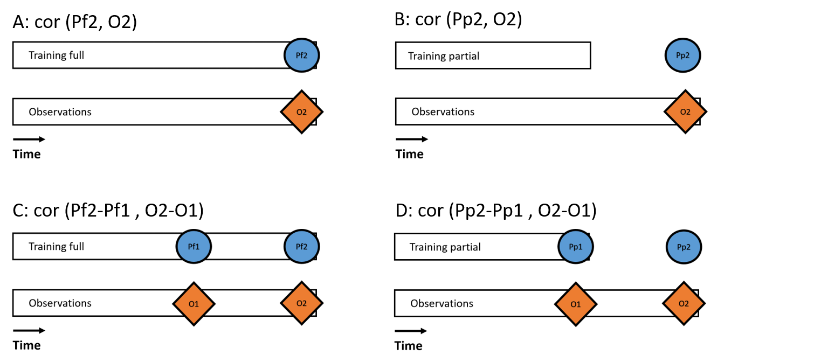

  
```{r, include=FALSE}
knitr::opts_chunk$set(echo = TRUE)
```
# 1. Ennustustarkkuuksien laskeminen

## 1.1 Ennustemallit
Malli on nyt ajettu 120 lajilla, joiden prevalenssi on ollut vähintään 0.05. Tällä hetkellä saatavilla on ollut vasta thin=10 aineisto. Mallista on ajettu kahta versiota. Toisessa on käytetty aineistoa vain vuoteen 1999 asti ja toisessa vuoteen 2016 asti.

Malleja, joiden tekemisessä oli käytetty aineistoa vain vuoteen 1999 asti, pyydettiin ennustamaan tulevaisuutta niin, että kaikki muut muuttujat paitsi vuosi muuttuivat. Vuosi fiksattiin paikoilleen vuoteen 1997.

Malli: XFormula = ~ JunJul + DJF + AprMay +Year + Urb + Br + Co + Op + Ma + We + Effort*Method  

Alla vielä koko koodi:

```{r}
#Malli:  

#XFormula = ~ JunJul + DJF + AprMay+
#  Year+Urb + Br + Co + Op + Ma + We + Effort*Method
#for (thin in c(1)){
#  samples = 1000
#  nChains = 4
#  for (modeltype in 1:2){
#    for (model in 1:2){
#      set.seed(1)
#      sel = if(model==1){sel1} else {sel2}
#      m = Hmsc(Y=if(modeltype==1){1*(Y[sel,]>0)} else {Yabu[sel,]},
#               XData = XData[sel,],  XFormula=XFormula,
#               distr=if(modeltype==1){"probit"} else {"normal"},
#               studyDesign=studyDesign[sel,])
#      
#      ptm = proc.time()
#      m = sampleMcmc(m, samples = samples, thin=thin,
#                     transient = ceiling(0.5*samples*thin),
#                     nChains = nChains, nParallel = nChains)
```

Meneehän malli varmasti oikein? Method ja Effort ovat nyt mielestäni kumpiakin samassa muuttujassa sekaisin. Method (P ja L, point ja line) Effort (esim. 20 pistettä tai 7000 metriä).

## 1.2 Neljä erilaista validointimetodia

Vaihtoehdot A,B,C,D.  

A ja B katsovat yhtä ajanhetkeä.  
C ja D katsovat muutosta tietyn ajanjakson aikana.  

A ja C interpoloivat.
B ja D ekstrapoloivat.

```{r echo=F, out.width='60%'}

```


## 1.3 Presence/absence aineisto 

### 1.3.1 Aineisto sisälle ja tarkastelu
```{r }
getwd()
localDir = "."
PredictionDir = file.path(localDir, "data")
```
```{r include=FALSE}
paketit<-c("readr","tidyr","dplyr","plyr","magrittr","purrr","data.table","plotrix","jtools","sp","GISTools","rgdal","sf","spatialEco","ggplot2","ggrepel","psych")
lapply(paketit,library,character.only=T)
```

```{r }
#model 1: data until 1999; model 2: full data
#mpred1: posterior mean based on model 1; mpred2: posterior mean based on model 2

samples = 1000
thin = 10
nChains = 4
modeltype = 1 #1 on pa-aineistolle

filename = file.path(PredictionDir, paste("predictions_",c("pa","abundance")[modeltype],
                                          "_chains_",as.character(nChains),"_thin_", as.character(thin),"_samples_", as.character(samples),
                                          ".Rdata",sep = ""))
load(filename) #mpred1, mpred2, Y, studyDesign

routes=levels(studyDesign$Route)
nr=length(routes)
years=levels(studyDesign$Year)
dim(mpred1)
ns=dim(mpred1)[2]
dim(mpred2)
dim(Y)
dim(studyDesign)
```

### 1.3.2 Periodien määrittely

Päädyttiiin valitsemaan aikaisempi ajankohta periodi 1:lle. Näin ennusteet tehdään pidemmälle aikavälille ja ehkä muutoksetkin ovat silloin isompia ja helpommin ennustettavia. Alunperin ajankohta oli 2003-2006 koska silloin aineistoa oli enemmän ja laadukkaammin saatavilla.

```{r}
period1=(studyDesign$Year=="Year_1996" | studyDesign$Year=="Year_1997" | studyDesign$Year=="Year_1998" | studyDesign$Year=="Year_1999")
period2=(studyDesign$Year=="Year_2013" | studyDesign$Year=="Year_2014" | studyDesign$Year=="Year_2015" | studyDesign$Year=="Year_2016")

pm1p1=mpred1[period1,]
pm2p1=mpred2[period1,]

pm1p2=mpred1[period2,] #pm1p2 = predictions by model 1 to period 2
pm2p2=mpred2[period2,]

y1=Y[period1,]
y2=Y[period2,]

sd1 = studyDesign[period1,]
sd2 = studyDesign[period2,]

visits1 = rep(NA,nr)
visits2 = rep(NA,nr)
for (i in 1:nr){
  visits1[i] = sum(sd1$Route==routes[i])
  visits2[i] = sum(sd2$Route==routes[i])
}
```


### 1.3.3 Ennustustarkkuudet metodeilla A ja B

Lasketaan ennustustarkkuus kun ennustetaan kunkin lajin esiintymistodennäköisyyttä yhtenä ajanhetkenä (periodi 2).  
A: Mallin kalibrointiin on käytetty aineistoa samalta ajalta.  
B: Mallin kalibrointiin EI ole käytetty aineistoa samalta ajalta.


```{r}
# COMPUTE MEASURES A AND B
selroutes = routes[which(visits2>=2)]  #periodi 2, joten vesilintujen NA:t eivät vaikuta näissä laskuissa
nsr = length(selroutes)

Ap1=matrix(NA,nrow = nsr,ncol = ns)
Ap2=matrix(NA,nrow = nsr,ncol = ns)
Ay=matrix(NA,nrow = nsr,ncol = ns)
for (i in 1:nsr){
  take = which(sd2$Route == selroutes[i])
  Ap1[i,] = colMeans(pm1p2[take,])
  Ap2[i,] = colMeans(pm2p2[take,])
  Ay[i,] = colMeans(y2[take,])
}
A = rep(NA,ns)
B = rep(NA,ns)
for (i in 1:ns){
  A[i] = cor(Ap2[,i],Ay[,i])
  B[i] = cor(Ap1[,i],Ay[,i])
}

plot(A,B,xlim=c(-1,1), ylim=c(-1,1)) + abline(0,1)+ abline(h=0)+ abline(v=0)
```

Molemmat metodit ennustavat hyvin. A:lle ennusteet ovat vähän parempia kuin B:lle. 


### 1.3.4 Ennustustarkkuudet metodeilla C ja D

Lasketaan ennustustarkkuus kun ennustetaan kunkin lajin esiintymistodennäköisyyden muutosta periodien 1 ja 2 välillä.  
C: Mallin kalibrointiin on käytetty aineistoa samalta ajalta.   
D: Mallin kalibrointiin EI ole käytetty aineistoa samalta ajalta (periodin 2 osalta).

```{r}
# COMPUTE MEASURES C AND D
selroutes = routes[which(visits1>=2 & visits2>=2)]
nsr = length(selroutes)

Ap1=matrix(NA,nrow = nsr,ncol = ns)
Ap2=matrix(NA,nrow = nsr,ncol = ns)
Ay=matrix(NA,nrow = nsr,ncol = ns)
for (i in 1:nsr){
  take1 = which(sd1$Route == selroutes[i])
  take2 = which(sd2$Route == selroutes[i])
  Ap1[i,] = colMeans(pm1p2[take2,])-colMeans(pm1p1[take1,]) #ennusteisiin ei tule NA:ta mutta seuraavissa laskuissa havaintojen NA eliminoi tämän ongelman 
  Ap2[i,] = colMeans(pm2p2[take2,])-colMeans(pm2p1[take1,])
  Ay[i,] = colMeans(y2[take2,])- colMeans(y1[take1,])   #Suomen vesilintujen NA:t säilyvät
}
C = rep(NA,ns)
D = rep(NA,ns)
for (i in 1:ns){
  C[i] = cor(Ap2[,i],Ay[,i], use="na.or.complete")  #NA:t eivät estä korrelaation laskemista koko lajille
  D[i] = cor(Ap1[,i],Ay[,i], use="na.or.complete")
}

plot(C,D,xlim=c(-1,1), ylim=c(-1,1)) + abline(0,1)+ abline(h=0)+ abline(v=0)
```
Molemmille metodeille ennusteet aika huonoja.


**HUOM!** Presence/absence aineistossa mm. Suomen vesilinnut ovat NA:ta ennen vuotta 2006. Periodi 1:sen kaikki arvot vesilinnuille Suomessa ovat siis NA, eivätkä tule mukaan laskelmiin. Korrelaatiota laskiessa argumentti "use="na.or.complete"" varmistaa, että korrelaatio lasketaan muista kuin NA-arvoista.  


Plottaan yhdelle lajille ennustetut (D) ja todelliset muutokset reiteittäin. Yksi piste on siis yksi reitti.

```{r}
pred=Ap1[,21]
obs=Ay[,21]
laji=as.data.frame(cbind(pred,obs))
#tarkistus
cor(pred,obs, use="na.or.complete")
#kuvaaja
ggplot(laji, aes(x=pred,y=obs))+ geom_point()+ xlim(-1,1)+ylim(-1,1)+ geom_abline(intercept = 0, slope =1) + geom_hline(yintercept=0) + geom_vline(xintercept = 0) +ggtitle("Viherpeippo")

#entäpä tikli?
pred=Ap1[,20]
obs=Ay[,20]
laji=as.data.frame(cbind(pred,obs))
#tarkistus
cor(pred,obs, use="na.or.complete")
#kuvaaja
ggplot(laji, aes(x=pred,y=obs))+ geom_point()+ xlim(-1,1)+ylim(-1,1)+ geom_abline(intercept = 0, slope =1) + geom_hline(yintercept=0) + geom_vline(xintercept = 0) +ggtitle("Tikli")
```

Yhtä lajia tarkastellessa huomaa miten pa-aineistolla ennusteet ovat lähellä nollaa mutta havainnot vaihtelevat "rajummin" -1 ja 1 välillä. Ennusteet ovat positiivisia mutta havainnot taitavat olla suuremmaksi osaksi nollaa tai negatiivisia. Viherpeipon ennustustarkkuus olikin pa-aineistolle -0.12. Tiklille tarkkuus oli parempi 0.37.

Tarkistan vielä kuinka monesta havaintoparista kunkin lajin korrelaatio on laskettu. Pa-aineistolla joukosta puuttuvat vain muutamat vesilintujen NA-havainnot. Abu-aineistolla tilanne on eri.

```{r}
P_D = rep(NA,ns)
for (i in 1:ns){
  P_D[i] = pairwiseCount(Ap1[,i],Ay[,i])
}
summary(P_D)
sort(P_D)
```

### 1.3.5 Tulokset

```{r}
#create a table
meres=c(mean(A,na.rm = TRUE),mean(B,na.rm = TRUE),mean(C,na.rm = TRUE),mean(D,na.rm = TRUE))
names(meres)=c("A","B","C","D")
meres
#write.csv(meres,file="pa_species_specific_route_level.csv")
```

Keskiarvot näyttävät suht surkeilta tyyleille C ja D. Eli nimenomaan muutoksen ennustaminen on vaikeaa. Vaikka mallin kalibrointiin olisi käytetty aineistoa samalta ajalta kuin mihin yritetään ennustaa (C).

```{r}
#save results as datatable for further analysis
species=colnames(Y)
pa_results=data.frame(species,A,B,C,D)
setnames(pa_results,c("A","B","C","D"),c("pa_A","pa_B","pa_C","pa_D"))
write.csv(pa_results, "pa_results.csv",row.names = F)
pa_results
```

Poimintoja, Metodi D:  
parhaat: Tikli 0.37, Peippo 0.33, Mustarastas 0.33, Järripeippo 0.32
huonoimmat: Sepelrastas -0.34, Fasaani -0.33, Satakieli -0.22, Hemppo -0.22


### 1.3.6 Todelliset ja ennustetut muutokset tutkimusalueella

Tarkastellaan absoluuttisia todellisia ja ennustettuja muutoksia esiintymistodennäköisyyksissä koko tutkimusalueella. Ennusteet on tehty joko tyyliin C tai D, eli koko aineistoa tai osittaista aineistoa hyödyntämällä. Paperiin voisi varmaan valita vain metodin D.

 
```{r}
#kannanmuutostrendien tarkastelu, lasketaan kaikilta linjoilta ennustetut ja todelliset kannanmuutokset
Ap1<-as.data.frame(Ap1)
Ap2<-as.data.frame(Ap2)
Ay<-as.data.frame(Ay)

#aineisto, jossa kullekin lajille laskettu kaikilta linjoilta ennustettu ja todellinen muutoksen keskiarvo (EI siis korrelaatio
# ennusteiden ja oikeiden muutosten välillä kuten aiemmin on laskettu)
kat=colnames(Y)
kat=as.data.frame(kat)
kat$Ap1k=colMeans(Ap1,na.rm = T)
kat$Ap2k<-colMeans(Ap2,na.rm = T)
kat$Ayk<-colMeans(Ay,na.rm = T)
```

Ensin tyyliin C, eli käyttäen koko aineistoa vuoteen 2016.

```{r }
ggplot(kat, aes(x=Ap2k, y=Ayk))+ geom_point()+ 
  geom_hline(yintercept = 0, color = "black")+ 
  geom_vline(xintercept = 0, color = "black")+ 
  xlab("Mean predicted change, C")+
  ylab("Mean observed change")+ 
  geom_abline(intercept = 0, slope = 1, color="red",linetype="dashed", size=1.5)+
  geom_text(aes(label=kat),hjust=0, vjust=0) + geom_smooth(method=lm,se=F)                                                                                        
```

Kuvassa yksi piste on yksi laji. X-akselilla on lajin ennustetun esiintymistod.näk. muutos. Y-akselilla todellinen muutos. Nämä on laskettu tutkimusalueen jokaisen reitin (missä lajia on havaittu) keskiarvona. Punainen katkoviiva merkkaa täydellista vastaavuutta. Mitä lähempänä viivaa havainto on, sitä paremmin ennuste on mennyt nappiin. Sininen viiva on aineiston regressiokäyrä.


Tyyli D, eli käyttäen aineistoa vuoteen 1999:

```{r }
ggplot(kat, aes(x=Ap1k, y=Ayk))+ 
  geom_point()+ geom_hline(yintercept = 0, color = "black")+ 
  geom_vline(xintercept = 0, color = "black")+ 
  xlab("Mean predicted change, D")+
  ylab("Mean observed change")+ 
  geom_abline(intercept = 0, slope = 1, color="red",linetype="dashed", size=1.5)+
  geom_text(aes(label=kat),hjust=0, vjust=0)+  geom_smooth(method=lm,se=F) 

#tallennetaan tarvittaessa
write.csv(kat,"mean_observed_predicted_changes_pa.csv",row.names = F)
```
Huomaa kuvissa hieman eri skaala. Kun mallintamisessa käytetään vähemmän aineistoa (-1999) ennustetut muutokset ovat joillekin lajeille (yläkulman Sylvia) hieman pienempiä.  

Näitä kuvia täytyy vielä säätää, jos niitä aiotaan käyttää julkaisussa jotenkin. 

## 1.4 Abundance-aineisto

Lasketaan kaikki samat asiat abundance-aineistolla.

```{r }
modeltype = 2 #2 on abu-aineistolle

filename = file.path(PredictionDir, paste("predictions_",c("pa","abundance")[modeltype],                                    "_chains_",as.character(nChains),"_thin_", as.character(thin),"_samples_", as.character(samples),".Rdata",sep = ""))

load(filename) #mpred1, mpred2, Y, studyDesign
routes=levels(studyDesign$Route)
nr=length(routes)
years=levels(studyDesign$Year)
dim(mpred1)
ns=dim(mpred1)[2]
dim(mpred2)
dim(Y)
dim(studyDesign)
```

### 1.4.1 Periodien määrittely

```{r }
pm1p1=mpred1[period1,]
pm2p1=mpred2[period1,]

pm1p2=mpred1[period2,] #pm1p2 = predictions by model 1 to period 2
pm2p2=mpred2[period2,]

y1=Y[period1,]
y2=Y[period2,]

sd1 = studyDesign[period1,]
sd2 = studyDesign[period2,]

visits1 = rep(NA,nr)
visits2 = rep(NA,nr)
for (i in 1:nr){
  visits1[i] = sum(sd1$Route==routes[i])
  visits2[i] = sum(sd2$Route==routes[i])
}
```

### 1.4.2 Ennustustarkkuudet A ja B

```{r }
# COMPUTE MEASURES A AND B
selroutes = routes[which(visits2>=2)]
nsr = length(selroutes)

Ap1=matrix(NA,nrow = nsr,ncol = ns)
Ap2=matrix(NA,nrow = nsr,ncol = ns)
Ay=matrix(NA,nrow = nsr,ncol = ns)

for (j in 1:ns) {
  for (i in 1:nsr){
    take = which(sd2$Route == selroutes[i] & y2[,j]>-1)
    Ap1[i,j] = mean(pm1p2[take,j])  
    Ap2[i,j] = mean(pm2p2[take,j])
    Ay[i,j] = mean(y2[take,j],na.rm=T)
  }}

A = rep(NA,ns)
B = rep(NA,ns)
for (i in 1:ns){
  A[i] = cor(Ap2[,i],Ay[,i],use="na.or.complete")   #lisäsin tähän määreen
  B[i] = cor(Ap1[,i],Ay[,i],use="na.or.complete")
}

plot(A,B,xlim=c(-1,1), ylim=c(-1,1)) + abline(0,1)+ abline(h=0)+ abline(v=0)
```
Molemmat metodit suht hyviä. A:lle ennusteet parempia.

### 1.4.3 Ennustustarkkuudet C ja D

```{r }
# COMPUTE MEASURES C AND D
selroutes = routes[which(visits1>=2 & visits2>=2)]
nsr = length(selroutes)

Ap1=matrix(NA,nrow = nsr,ncol = ns)
Ap2=matrix(NA,nrow = nsr,ncol = ns)
Ay=matrix(NA,nrow = nsr,ncol = ns)

for (j in 1:ns){
  for (i in 1:nsr){
    take1 = which(sd1$Route == selroutes[i] & y1[,j]>-1)
    take2 = which(sd2$Route == selroutes[i]& y2[,j]>-1)
    Ap1[i,j] = mean(pm1p2[take2,j])-mean(pm1p1[take1,j]) #ka laskettava vain vuosilta, jolloin lajia on havaittu
    Ap2[i,j] = mean(pm2p2[take2,j])-mean(pm2p1[take1,j]) #riittää, että on edes kerran pystytty laskemaan lajia
    Ay[i,j] = mean(y2[take2,j],na.rm=T)- mean(y1[take1,j],na.rm=T) #NA:t eivät saa estää keskiarvon laskemista koko lajille.
  }}

C = rep(NA,ns)
D = rep(NA,ns)
for (i in 1:ns){
  C[i] = cor(Ap2[,i],Ay[,i],use="na.or.complete")    #lisäsin tähän määreen
  D[i] = cor(Ap1[,i],Ay[,i],use="na.or.complete")
}
plot(C,D,xlim=c(-1,1), ylim=c(-1,1)) + abline(0,1)+ abline(h=0)+ abline(v=0)
```
Molemmat metodit arvioivat ennusteet suht huonoiksi.

**HUOM!** Abundance aineistolla riittää, että lajia on kunkin periodin aikana havaittu edes kerran. PA-aineistolla havaintoja piti olla vähintään kaksi. 

### 1.4.4 Tulokset

```{r }
meres=c(mean(A,na.rm = TRUE),mean(B,na.rm = TRUE),mean(C,na.rm = TRUE),mean(D,na.rm = TRUE))
names(meres)=c("A","B","C","D")
meres
```

Myös abu-aineistolla varsinkin muutoksen ennustaminen on vaikeaa.

```{r }
#save as datatable
species=colnames(Y)
abu_results=data.frame(species,A,B,C,D)
setnames(abu_results,c("A","B","C","D"),c("abu_A","abu_B","abu_C","abu_D"))
write.csv(abu_results, "abu_results.csv",row.names = F)

#combine data frames
res=inner_join(pa_results,abu_results,by="species")

#save as csv for further analysis
write.csv(res,"results.csv",row.names = F)
abu_results
```
Poimintoja, D:  

parhaat: Pohjansirkku 0.95!!, Lehtokurppa 0.40, Pyrstötiainen 0.40, Sääksi 0.39
huonoimmat: Tukkasotka -0.35, merihanhi -0.34, Punavarpunen -0.33, Sinirinta -0.30


Plottaan malliksi viherpeipon ja pohjansirkun.

```{r}
pred=Ap1[,21]
obs=Ay[,21]
laji=as.data.frame(cbind(pred,obs))
#tarkistus
cor(pred,obs, use="na.or.complete")
#kuvaaja
ggplot(laji, aes(x=pred,y=obs))+ geom_point()+ xlim(-2,2)+ylim(-2,2)+ geom_abline(intercept = 0, slope =1) + geom_hline(yintercept=0) + geom_vline(xintercept = 0) +ggtitle("Viherpeippo")

#entäpä pohjansirkku?
pred=Ap1[,40]
obs=Ay[,40]
b=as.data.frame(cbind(pred,obs))
b
pairwiseCount(pred,obs)
laji=as.data.frame(cbind(pred,obs))
#tarkistus
cor(pred,obs, use="na.or.complete")
#kuvaaja
ggplot(laji, aes(x=pred,y=obs))+ geom_point()+ xlim(-2,2)+ylim(-2,2)+ geom_abline(intercept = 0, slope =1) + geom_hline(yintercept=0) + geom_vline(xintercept = 0) +ggtitle("Pohjansirkku")
```

Abu-aineistolla viherpeipon muutoksen ennusteet ovat suurimmaksi osaksi hieman negatiivisia ja havainnot (joissa taas suurta vaihtelua) ovat myös suurimmaksi osaksi lähellä nollaa tai negatiivisia. Viherpeipon ennustustarkkuus onkin abu-aineistolla (0.016) hieman parempi kuin pa-aineistolla (-0.12). 

Pohjansirkun ennustustarkkuus oli 0.95. 

```{r}
P_D = rep(NA,ns)
for (i in 1:ns){
  P_D[i] = pairwiseCount(Ap1[,i],Ay[,i])
}
summary(P_D)
sort(P_D)
```

Pohjansirkun hyvä ennustustarkkuus (0.95) selittyy sillä, että siitä on havaintoja vain kolmelta reitiltä. Ntype-analyysissähän tarkasteltiin, kuinka ennustustarkkuuteen vaikuttaa se, kuinka monta kertaa kukin reitti on laskettu. Tarkkuus näyttää myös vaihtelevan sen mukaan kuinka monelta reitiltä havainnot on kerätty. Sitähän me ei olla kontrolloitu laskuissa muuten kuin prevalenssilla (0.05). Prevalenssi on kuitenkin laskettu koko aineistosta. Muutosta laskiessa huomioidaan vain periodien 1 ja 2 reitit. pa-aineistolla laskuihin päätyvät vähintään kahteen kertaan lasketut reitit. Abu-aineistolla riittää yksikin havainto.

**Huom!** Muista, että abu-arvot ovat yksilömäärien logaritmeja.


### 1.4.5 Todelliset ja ennustetut muutokset tutkimusalueella

```{r }
#kannanmuutostrendien tarkastelu, lasketaan kaikilta linjoilta ennustetut ja todelliset kannanmuutokset
Ap1<-as.data.frame(Ap1)
Ap2<-as.data.frame(Ap2)
Ay<-as.data.frame(Ay)

#aineisto, jossa kullekin lajille laskettu kaikilta linjoilta ennustettu ja todellinen muutoksen keskiarvo (EI siis korrelaatio
# ennusteiden ja oikeiden muutosten v?lill? kuten aiemmin on laskettu)
kat=colnames(Y)
kat=as.data.frame(kat)
kat$Ap1k=colMeans(Ap1,na.rm = T)
kat$Ap2k<-colMeans(Ap2,na.rm = T)
kat$Ayk<-colMeans(Ay,na.rm = T)
```

Tyyli C.

```{r }
ggplot(kat, aes(x=Ap2k, y=Ayk))+ geom_point()+ 
  geom_hline(yintercept = 0, color = "black")+ 
  geom_vline(xintercept = 0, color = "black")+
  xlab("Mean predicted change, C")+
  ylab("Mean observed change")+ 
  geom_abline(intercept = 0, slope = 1, color="red",linetype="dashed", size=1.5)+
  geom_text(aes(label=kat),hjust=0, vjust=0) +  geom_smooth(method=lm,se=F)                                                                                                                      
```

Tyyli D.

```{r }
ggplot(kat, aes(x=Ap1k, y=Ayk))+ 
  geom_point()+ geom_hline(yintercept = 0, color = "black")+ 
  geom_vline(xintercept = 0, color = "black")+
  xlab("Mean predicted change, D")+
  ylab("Mean observed change")+ 
  geom_abline(intercept = 0, slope = 1, color="red",linetype="dashed", size=1.5)+
  geom_text(aes(label=kat),hjust=0, vjust=0)+  geom_smooth(method=lm,se=F) +xlim(-0.3,0.3)+ylim(-1,1)

write.csv(kat,"mean_observed_predicted_changes_abu.csv",row.names = F)
```

Kuvien skaalat eroavat taas hieman. Skaalan säätäminen tehtävä niin, että labeleistä pystyisi lukemaan edes jotain. 
